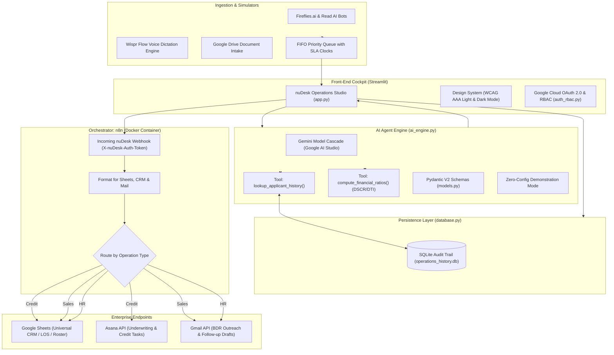
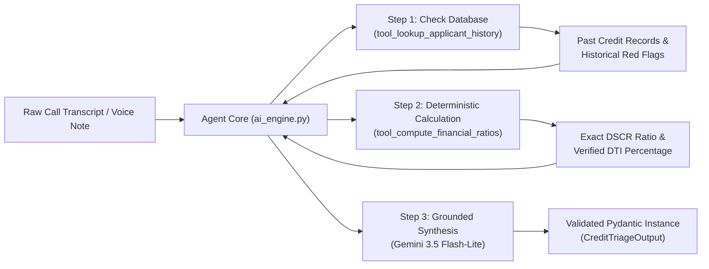
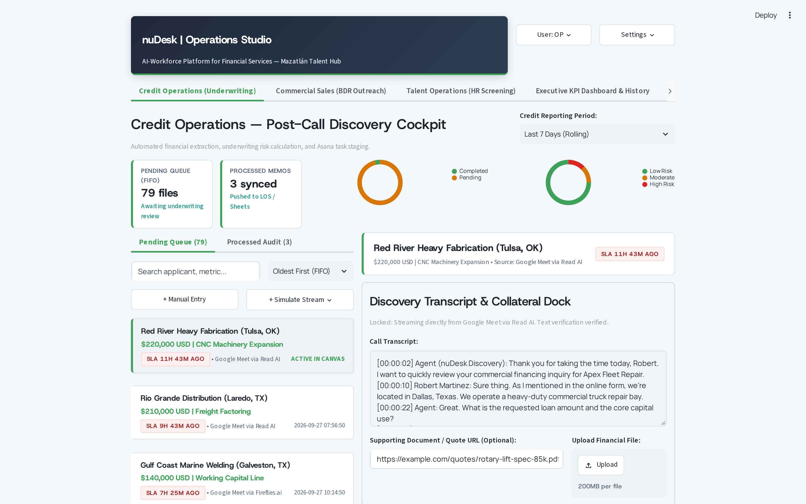
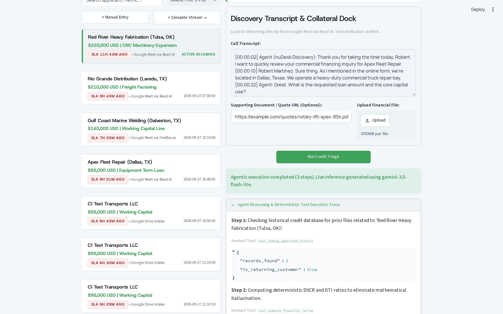
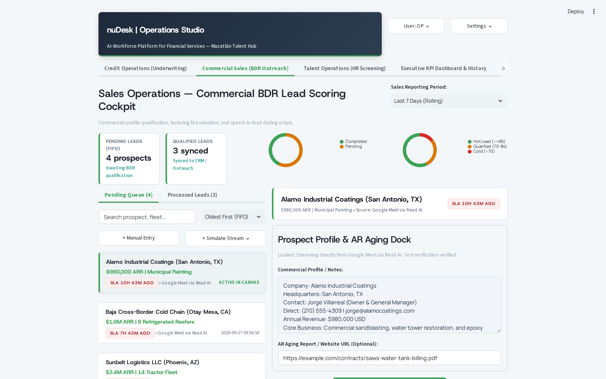
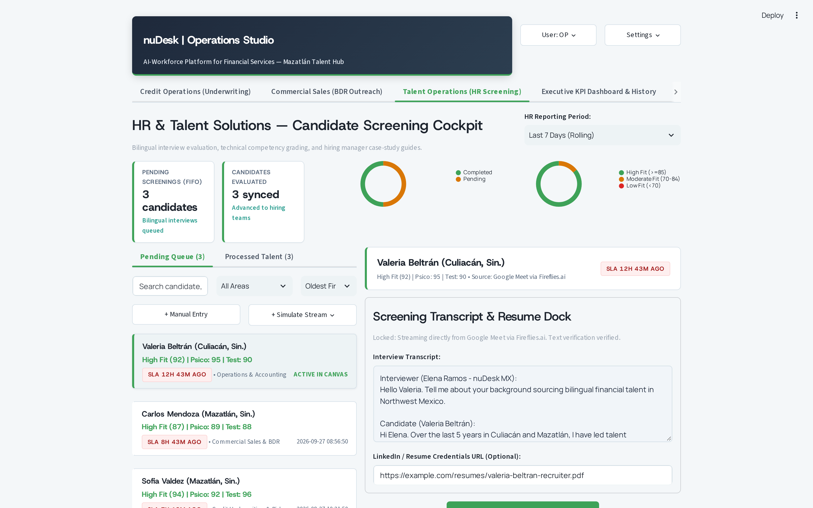
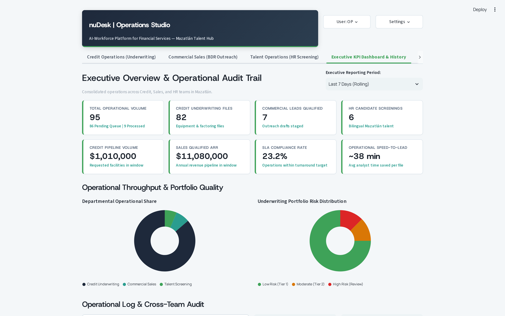
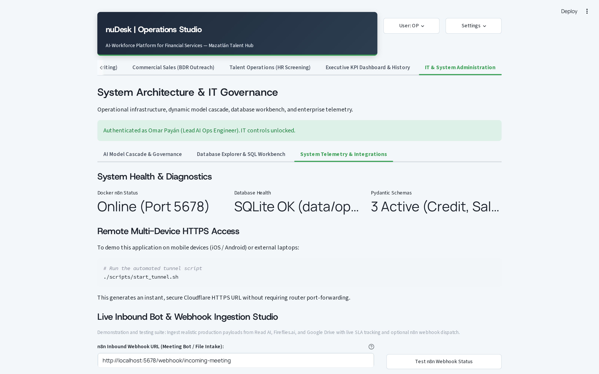
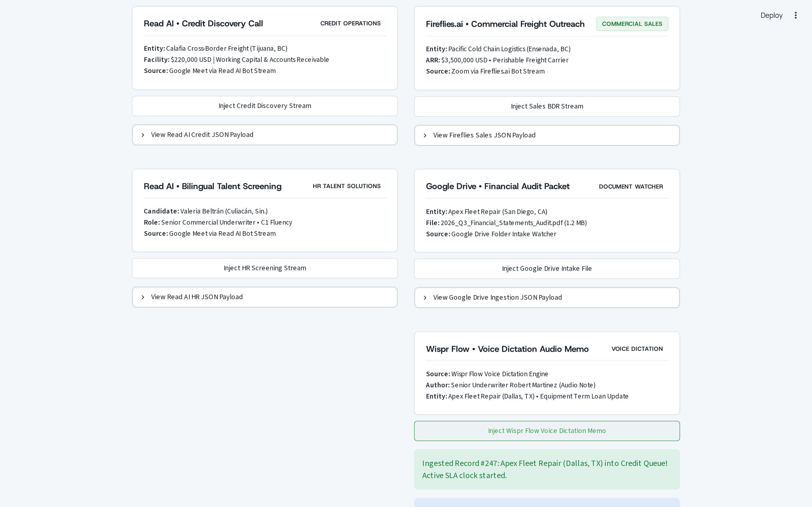
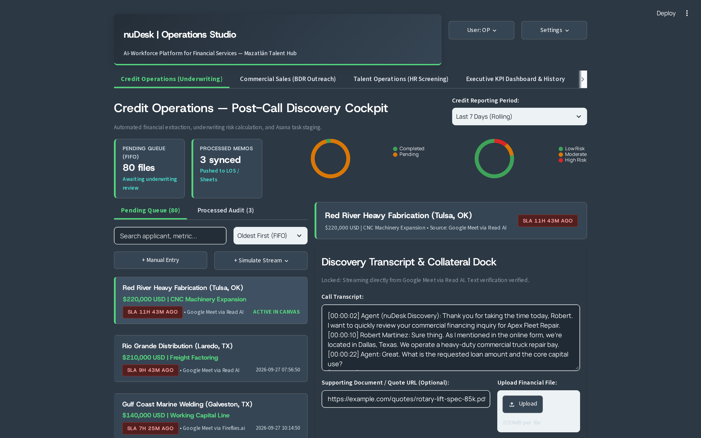

# nuDesk Operations Studio
### AI-Powered Credit Triage & Sales Acceleration Engine for Financial Services (FinServ)
**nuDesk MX Technical Assessment | Candidate: Christian Omar Payán Torróntegui**

[](https://github.com/opyntorr/nudesk-ai-ops-pipeline/actions/workflows/ci.yml)

---

## 1. Executive Summary & Business Context

At **nuDesk MX**, operational teams in Mazatlán, Sinaloa partner with US commercial lenders, regional banks, and factoring firms to streamline debt origination, sales outreach, and underwriting workflows. 

Traditional BPOs scale operational capacity by linearly increasing headcount ("seat count"), resulting in high overhead, employee fatigue on manual data entry, and delayed turnaround times. nuDesk disrupts this paradigm through the **Cyborg Organization Model**: pairing bilingual human specialists with domain-trained AI agents to multiply productivity while safeguarding credit compliance.

**nuDesk Operations Studio** eliminates the most common operational bottlenecks faced by cross-border FinServ teams:

1. **Credit Operations (Post-Call Discovery Triage):**
   - **Problem:** Loan officers and discovery agents conduct 15-to-30 minute calls with US business owners. Manually listening to recordings or reading transcripts to extract financial parameters (debt, revenue, equipment quotes, tax liens) and creating underwriting tickets takes 40+ minutes per file.
   - **Solution:** Ingests raw call transcripts (from dialers, Fireflies.ai, or Wispr Flow audio memos), invokes deterministic financial calculation tools, extracts key financial variables into strict Pydantic JSON schemas, computes an initial risk tier (Low, Moderate, High), isolates underwriting red flags, and automatically generates prioritized action items for Asana.

2. **Sales Operations (BDR Lead Scoring & Rapid Outreach):**
   - **Problem:** Business Development Representatives (BDRs) in Mazatlán prospecting US logistics, construction, and manufacturing companies must manually research company viability, assess working capital fit, and draft custom outreach messages.
   - **Solution:** Ingests commercial prospect profiles, computes an objective lead score from 1 to 100 based on urgency and collateral viability, provides clear underwriting rationale, and generates both an executive cold email draft and a 30-second telephone pitch tailored for high-conversion outbound dialing.

3. **HR Solutions (Bilingual Talent Screening):**
   - **Problem:** Vetting high-volume candidate interviews for English fluency, commercial empathy, and debt qualification skills requires hours of interview review.
   - **Solution:** Evaluates CEFR fluency, scores cultural competencies, identifies candidate red flags, and drafts targeted behavioral probing questions for hiring managers.

4. **Enterprise Dispatch & Hyperautomation (n8n & Google Workspace):**
   - Validated data structures are dispatched via HTTP POST webhooks to a local **n8n** orchestration engine (running in Docker), which routes and persists data into Google Sheets (acting as a live CRM/Pipeline tracker), stages email drafts in Gmail, and creates tasks in Asana.

---

## 2. Alignment with Enterprise Tech Stack

nuDesk Operations Studio was specifically designed to mirror and integrate with the enterprise technology stack utilized by the company:

| Enterprise Tool | Integration in nuDesk Operations Studio | Implementation Details |
|---|---|---|
| **Claude Code & Gemini Antigravity** | Model-Agnostic Inference Cascade & Agentic Engine | Candidate cascade supporting `gemini-3.5-flash-lite`, `gemini-3.5-flash`, and `gemini-1.5-pro` with automatic fallback to pre-computed benchmark records. |
| **Google Cloud Platform (GCP)** | OAuth 2.0 Single Sign-On & GenAI API | Live Google Workspace login via Google Cloud Console credentials with role-based access control (RBAC). |
| **Wispr Flow** | Inbound Voice Dictation Audio Memo Intake | Specialized intake channel that ingests rapid audio dictation memos from underwriters and BDRs, converting speech transcripts into structured data. |
| **Fireflies.ai / Read AI** | Meeting Recorder Webhook Simulator | Ingestion studio for dialer and Google Meet call transcripts with automated FIFO priority queue and live SLA tracking. |
| **Asana** | Automated Underwriting Task Assignment | Automatic generation of standard operating tasks with urgency priority ("High", "Medium", "Low") and operational role assignments. |
| **Google Workspace (Sheets & Gmail)** | Universal CRM & Staged Outreach Drafts | n8n routes triaged records into Google Sheets (Credit LOS, Sales CRM, Talent Roster) and creates reviewable drafts directly in the Gmail outbox. |

---

## 3. System Architecture & Data Flow



---

## 4. Autonomous Agent Loop (Tool Calling & Deterministic Grounding)

To eliminate numerical hallucinations (such as incorrect Debt-to-Income or coverage ratios), the AI engine uses deterministic tool grounding:



---

## 5. Visual Cockpit Tour & Live Demonstration Gallery

The following high-resolution captures illustrate the end-to-end execution of nuDesk Operations Studio across all operational personas and system subsystems:

### 5.1 Credit Operations Triage Cockpit
Ingests raw discovery call transcripts, isolates underwriting red flags, displays deterministic financial calculations, and stages automated Asana tasks for loan officers.



### 5.2 Autonomous Agent Reasoning Trace & Deterministic Tool Loop
Exposes the multi-step agent execution log. The agent invokes `tool_lookup_applicant_history` to inspect prior applicant records and `tool_compute_financial_ratios` to compute DSCR and DTI deterministically without numerical hallucinations, before synthesizing the final Pydantic response.



### 5.3 Commercial Sales Operations (BDR Lead Scoring & Outreach)
Scores commercial prospects on urgency, collateral viability, and working capital fit. Generates both an executive cold email draft and a 30-second conversational outbound telephone pitch.



### 5.4 Talent Operations (Bilingual Candidate Screening)
Automates bilingual interview assessment, grading CEFR English fluency, commercial empathy, and debt qualification aptitude while drafting behavioral probing questions for hiring managers.



### 5.5 Executive KPI Dashboard & Operations Audit Trail
Real-time operational intelligence tracking throughput, SLA adherence, and department-level distribution backed by a permanent SQLite audit trail (`operations_history.db`).



### 5.6 IT System Workbench & Wispr Flow Voice Dictation Integration
Administrative console providing model cascade testing, live database inspection, webhook health telemetry, and voice memo intake simulating Wispr Flow dictation.



### 5.7 Inbound Voice Dictation Ingestion Confirmed
Demonstrates immediate FIFO priority queue intake upon receiving a rapid voice dictation memo from an underwriter or BDR in the field.



### 5.8 High-Contrast Dark Mode Appearance
Full WCAG AAA compliance supporting dark mode environments for late-shift underwriting teams.



---

## 6. Repository Structure

```text
nudesk-ai-ops-pipeline/
├── .github/
│   └── workflows/
│       └── ci.yml                  # GitHub Actions CI pipeline (Python 3.10 & 3.11)
├── .env.example                    # Environment template (Gemini, OAuth, Webhooks, Admin emails)
├── .gitignore                      # Security exclusions (ignoring .env and SQLite DBs)
├── Makefile                        # Developer automation (install, test, run, docker-up)
├── README.md                       # Architectural and technical documentation
├── requirements.txt                # Pinned dependencies (Streamlit, GenAI, Pydantic, Requests)
├── docker-compose.yml              # Container definition for local n8n instance
├── n8n_workflow_blueprint.json     # Workflow blueprint for multi-flow triage & Workspace sync
├── app.py                          # Streamlit FinTech Operations Cockpit
├── auth_rbac.py                    # Google Cloud OAuth 2.0 & strict RBAC whitelist engine
├── database.py                     # SQLite persistent audit trail & operations log
├── document_reader.py              # Multi-modal collateral ingestion (URLs & files)
├── meeting_queue.py                # Automated meeting queue (Read AI, Fireflies, Wispr Flow)
├── models.py                       # Pydantic schemas (Credit, Sales, HR, AsanaTask)
├── ai_engine.py                    # Multi-model cascade & autonomous agent tools
├── crm_dispatcher.py               # Resilient webhook dispatcher with auth token support
├── mock_data.py                    # Benchmark transcripts and candidate records
├── styles/
│   └── nudesk_theme.py             # Design system tokens and WCAG AAA Light/Dark theme engine
├── scripts/
│   ├── e2e_playwright_audit.py     # Playwright headless browser E2E test & screenshot capture
│   ├── generate_synthetic_intake.py# Synthetic intake generator (Read AI, Fireflies, GDrive, Wispr)
│   ├── ingest_incoming_file.py     # File and URL ingestion pipeline
│   ├── start_tunnel.sh             # Cloudflare HTTPS tunnel for mobile demo
│   └── test_n8n_pipeline.py        # End-to-end integration test runner
└── tests/
    └── test_v2_suite.py            # Comprehensive 74-test automated suite
```

---

## 7. Quickstart Guide (Zero-Config Test)

### Prerequisites
- Python 3.10+
- (Optional) Docker & Docker Compose (for local n8n container)
- (Optional) Google AI Studio API key from [aistudio.google.com](https://aistudio.google.com/)

### Step 1: Clone and Set Up Virtual Environment
```bash
git clone https://github.com/opyntorr/nudesk-ai-ops-pipeline.git
cd nudesk-ai-ops-pipeline

python3 -m venv .venv
source .venv/bin/activate  # On Windows: .venv\Scripts\activate

# Install dependencies
make install
```

### Step 2: Configure Environment
```bash
cp .env.example .env
```
- **Zero-Config Demonstration Mode:** If `.env` is left with placeholder values, the application runs with 100% functionality using pre-computed realistic benchmarks and synthetic agent traces.
- **Live AI Mode:** Paste your `GEMINI_API_KEY` into `.env`.
- **Google OAuth 2.0:** Enter `GOOGLE_CLIENT_ID` and `GOOGLE_CLIENT_SECRET` from Google Cloud Console.

### Step 3: Run the Dashboard
```bash
make run
# Or directly:
streamlit run app.py
```
Open your browser at `http://localhost:8501`.

---

## 8. Developer Commands (Makefile)

| Command | Description |
|---|---|
| `make install` | Installs all Python dependencies into active virtual environment |
| `make test` | Executes the 74-test automated test suite |
| `make run` | Starts the Streamlit dashboard on port 8501 |
| `make tunnel` | Launches secure Cloudflare HTTPS tunnel for mobile/remote testing |
| `make docker-up` | Launches local n8n container in the background |
| `make docker-down` | Gracefully shuts down the local n8n container |
| `make clean` | Removes bytecode caches and temporary files |

---

## 9. Continuous Integration & Test Suite

The repository is guarded by an automated GitHub Actions CI pipeline (`.github/workflows/ci.yml`) running on every push and pull request across **Python 3.10** and **Python 3.11**.

To run the full suite locally:
```bash
make test
```

### Test Suite Coverage (74 Tests):
- **Data Contracts:** Validates Pydantic V2 models for Credit, Sales, and HR.
- **Agentic Tools:** Verifies deterministic calculation of DSCR and DTI ratios and historical database lookups.
- **Voice Dictation:** Tests Wispr Flow payload parsing and ingestion.
- **Authentication & RBAC:** Verifies strict admin whitelist matching and OAuth URL construction.
- **Persistence:** Verifies SQLite operations log, schema migrations, and SLA calculations without data loss.
- **UI & Accessibility:** Validates WCAG AAA color contrast, container docks, and headless Streamlit execution.

---

## 10. Running Local n8n Workflow Orchestration (Docker)

To test end-to-end webhook dispatch and Google Workspace routing locally:

1. Start the n8n container:
   ```bash
   make docker-up
   ```
2. Open the visual workflow editor at `http://localhost:5678/`.
3. Click **Workflows** -> **Import from File** and select `n8n_workflow_blueprint.json`.
4. Click **Activate Workflow**.
5. Click **Approve & Sync** in the nuDesk Operations Studio dashboard to watch records flow into n8n in real time.

---

## 11. Authors & Engineering Credits

- **Lead Operations & Automation Engineer:** Christian Omar Payán Torróntegui ([@opyntorr](https://github.com/opyntorr))
- **AI Architecture & Implementation Co-pilot:** Antigravity (Google DeepMind)
